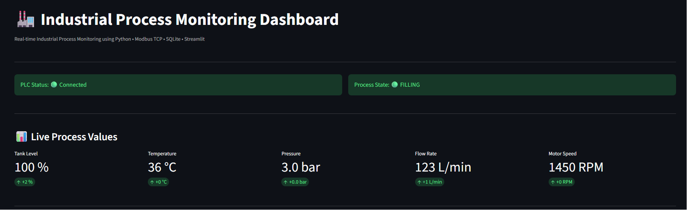
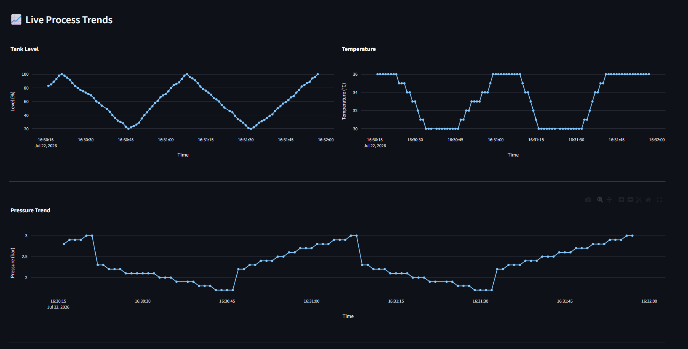
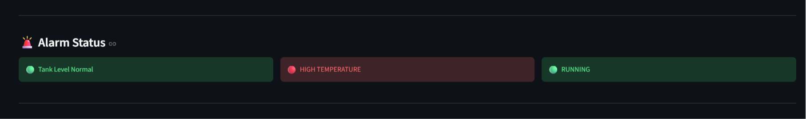
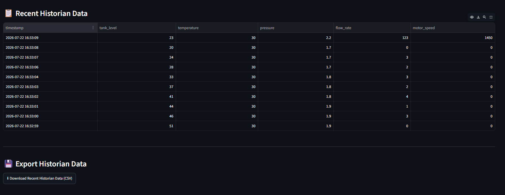

<div align="center">

# 🏭 Industrial Process Monitoring Dashboard

### *A SCADA-Style Industrial Monitoring System using Python, Modbus TCP, SQLite & Streamlit*


*A complete end-to-end industrial data acquisition and monitoring system inspired by real-world SCADA architecture.*

</div>

---

# 📖 Overview

Industrial Process Monitoring Dashboard is a Python-based industrial automation project that demonstrates how process data is acquired, transmitted, stored, and visualized in real time.

The system simulates an industrial process, exchanges data through the **Modbus TCP protocol**, stores historical values in an **SQLite Historian**, and presents live process information through a **SCADA-style dashboard** built with Streamlit.

This project was designed to mimic the architecture commonly found in modern industrial automation systems.

---

# 🎯 Why I Built This Project

Industrial automation systems rely on continuous monitoring of process variables, reliable communication protocols, and historical data logging for operational analysis.

This project was developed to demonstrate the practical implementation of these concepts using **Python** and **Modbus TCP**, following an architecture similar to a basic **SCADA system**.

It showcases technical skills that are directly relevant to entry-level **Automation & Control Systems Engineering** roles, including industrial communication, data acquisition, historian development, and real-time visualization.

---

# 🚀 Features

✅ Industrial Process Simulation

✅ Modbus TCP Communication

✅ SQLite Historian

✅ Live SCADA Dashboard

✅ Real-Time KPI Monitoring

✅ Alarm Monitoring System

✅ Interactive Trend Charts

✅ Process History Table

✅ CSV Data Export

✅ Automatic Dashboard Refresh

---

# 🛠️ Technologies Used

| Category | Technology |
|----------|------------|
| Programming Language | Python |
| Industrial Protocol | Modbus TCP |
| Modbus Server | ModRSsim2 |
| Database | SQLite |
| Dashboard | Streamlit |
| Data Analysis | Pandas |
| Visualization | Plotly |
| Communication Library | pymodbus |

---

# 🏗️ System Architecture

```text
                 Python Process Simulator
                          │
                          ▼
               ModRSsim2 (Modbus TCP Server)
                          │
                          ▼
               Python Modbus Client / Logger
                          │
                          ▼
                    SQLite Historian
                          │
                          ▼
          Streamlit SCADA Monitoring Dashboard
```

---

# ⚙️ Process Variables

The simulator continuously generates realistic industrial process data.

| Variable | Unit |
|----------|------|
| Tank Level | % |
| Temperature | °C |
| Pressure | bar |
| Flow Rate | L/min |
| Motor Speed | RPM |

---

# 📊 Dashboard Features

## 📈 Live KPI Cards

The dashboard displays real-time values for:

- Tank Level
- Temperature
- Pressure
- Flow Rate
- Motor Speed

---

## 🚨 Alarm Monitoring

Automatic monitoring for abnormal operating conditions.

- High Tank Level
- High Temperature
- High Pressure
- Motor Running / Stopped Status

---

## 📉 Live Trend Charts

Interactive Plotly charts for:

- Tank Level Trend
- Temperature Trend
- Pressure Trend

---

## 📋 Process Historian

Displays the latest process records stored in the SQLite database.

---

## 💾 CSV Export

Download historical process data for offline analysis.

---

# 📂 Project Structure

```text
Industrial-Process-Monitoring-Dashboard
│
├── dashboard/
│   └── app.py
│
├── database/
│   ├── database_setup.py
│   └── process_data.db
│
├── modbus/
│   ├── process_simulator.py
│   └── modbus_client.py
│
├── screenshots/
│
├── requirements.txt
│
└── README.md
```

---

# 🖥️ Installation

## 1️⃣ Clone the Repository

```bash
git clone https://github.com/yourusername/Industrial-Process-Monitoring-Dashboard.git
```

---

## 2️⃣ Install Dependencies

```bash
pip install -r requirements.txt
```

---

## 3️⃣ Configure ModRSsim2

```
IP Address : 127.0.0.1
Port       : 502
```

---

## 4️⃣ Initialize Database

```bash
python database/database_setup.py
```

---

## 5️⃣ Start Process Simulator

```bash
python modbus/process_simulator.py
```

---

## 6️⃣ Start Data Logger

```bash
python modbus/modbus_client.py
```

---

## 7️⃣ Launch Dashboard

```bash
streamlit run dashboard/app.py
```

---

# 📸 Project Screenshots

## 🖥️ Dashboard Overview

A complete SCADA-style dashboard displaying live process status, KPIs, alarms, and historical trends.

<p align="center">
  
</p>

---

## 📈 Live Trend Charts

Interactive Plotly charts visualizing real-time trends of key industrial process variables.

<p align="center">
  
</p>

---

## 🚨 Alarm Monitoring Panel

Real-time monitoring of process alarms and equipment status, providing immediate visual feedback for abnormal operating conditions.

<p align="center">
  
</p>

---

## 📋 Process Historian

Displays the latest process records stored in the SQLite historian database, with support for CSV export.

<p align="center">
  
</p>


# 🎓 Learning Outcomes

This project helped me gain practical experience in:

- Industrial Communication Protocols
- Modbus TCP Networking
- Industrial Data Acquisition
- Process Simulation
- Historian Database Design
- Real-Time Monitoring Systems
- SCADA Dashboard Development
- Python for Industrial Automation
- Data Visualization
- Industrial Software Architecture

---

# 🔮 Future Improvements

- OPC UA Integration
- MQTT Support
- Siemens PLC Integration
- Multi-Device Monitoring
- Alarm History Logging
- User Authentication
- Email Notifications
- Docker Deployment
- Cloud Historian Support

---

# 👨‍💻 Author

## **Fuad Faisal**

**Automation & Control Systems Engineer**

📍 Kerala, India

### Areas of Interest

- Industrial Automation
- PLC Programming
- SCADA Systems
- Industrial Communication
- Industrial Python
- Mechatronics Engineering

---

<div align="center">

### ⭐ If you found this project interesting, consider giving it a Star!

</div>

---

# 📄 License

This project is licensed under the **MIT License**.